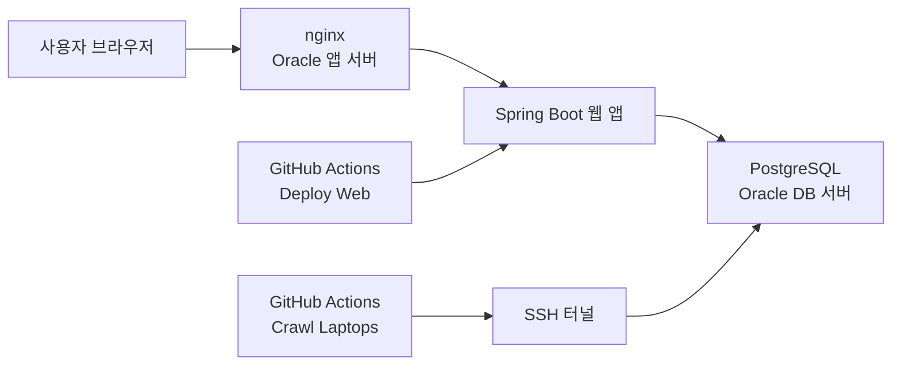

# LaptopGG

LaptopGG는 사용 목적, 예산, 무게, 화면 크기를 기준으로 노트북을 추천하고, 다나와 크롤링 데이터를 정규화해 상세 스펙과 추천 이유를 함께 보여주는 서비스입니다.

## 운영 구조



- 웹 서버는 Oracle 인스턴스에서 `systemd + java -jar`로 실행합니다.
- 리버스 프록시는 `nginx`가 담당합니다.
- 데이터베이스는 PostgreSQL을 사용합니다.
- `main` 브랜치에 push 하면 웹 앱이 자동 배포됩니다.
- 크롤러는 GitHub Actions에서 수동 실행하거나 스케줄 실행합니다.
- 목록 크롤링은 Danawa HTTP/AJAX 요청 기반이라 Chrome/Selenium 설치가 필요 없습니다.
- 운영 PostgreSQL 스키마는 Flyway 마이그레이션으로 관리합니다.
- 크롤러는 기존 상품의 가격/이미지/링크를 빠르게 갱신하고, 상세 스펙이 비었거나 오래된 상품만 다시 자세히 수집합니다.
- 가격 변동 이력은 `laptop_price_history` 테이블에 저장합니다.

## 저장소 구조

- `src/main/kotlin`: 애플리케이션 코드
- `src/main/resources`: 설정 파일과 템플릿
- `src/main/resources/db/migration`: PostgreSQL Flyway 마이그레이션
- `.github/workflows/ci.yml`: 테스트
- `.github/workflows/deploy-web.yml`: 웹 배포
- `.github/workflows/crawler.yml`: 크롤러 실행
- `nginx/oracle-laptopgg.conf`: Oracle 서버용 nginx 기준 설정
- `docker-compose.postgres.yml`: 로컬 PostgreSQL 실행용

저장소 루트가 곧 Gradle 프로젝트 루트입니다. 별도 하위 프로젝트로 들어갈 필요가 없습니다.

## 로컬 실행

### 1. PostgreSQL 실행

```bash
docker compose -f docker-compose.postgres.yml up -d
```

### 2. 웹 앱 실행

```bash
export JAVA_HOME=$(/usr/libexec/java_home -v 17)
export PATH="$JAVA_HOME/bin:$PATH"
export SPRING_DATASOURCE_URL=jdbc:postgresql://localhost:5432/laptopgg
export SPRING_DATASOURCE_USERNAME=laptopgg
export SPRING_DATASOURCE_PASSWORD=laptopgg
./gradlew bootRun --args='--spring.profiles.active=postgres'
```

주의:
- `postgres` 프로필에서는 Flyway가 먼저 스키마를 맞춘 뒤 앱이 기동합니다.
- 기존 운영 DB처럼 이미 테이블이 있는 환경은 `baseline-on-migrate`로 안전하게 편입됩니다.

### 3. 크롤러만 단독 실행

```bash
export JAVA_HOME=$(/usr/libexec/java_home -v 17)
export PATH="$JAVA_HOME/bin:$PATH"
export SPRING_DATASOURCE_URL=jdbc:postgresql://localhost:5432/laptopgg
export SPRING_DATASOURCE_USERNAME=laptopgg
export SPRING_DATASOURCE_PASSWORD=laptopgg
./gradlew bootRun --args='--spring.profiles.active=postgres,crawler --app.crawler.limit=3'
```

### 4. 확인 주소

- 웹: `http://localhost:8080`
- 추천 화면: `http://localhost:8080/recommends`
- 상세 화면: `http://localhost:8080/laptops/{id}`
- 크롤링 API: `GET /api/crawl/laptops?limit=3`

주의:
- `/api/crawl/laptops` 엔드포인트는 로컬/비배포 프로필에서만 열립니다.
- 배포 프로필에서는 GitHub Actions 크롤러만 사용합니다.

## 테스트

```bash
export JAVA_HOME=$(/usr/libexec/java_home -v 17)
export PATH="$JAVA_HOME/bin:$PATH"
./gradlew --no-daemon test
```

회귀 테스트에는 실제 Danawa 구조를 닮은 HTML fixture가 포함됩니다.
- `src/test/resources/fixtures/danawa/list-page.html`
- `src/test/resources/fixtures/danawa/detail-page.html`
- `src/test/resources/fixtures/danawa/detail-spec.html`

## 웹 배포

`main` 브랜치에 push 하면 `.github/workflows/deploy-web.yml` 이 실행됩니다.

배포 순서:
1. GitHub Actions가 JDK 17로 `bootJar`를 빌드합니다.
2. 생성된 `app.jar`를 앱 서버로 업로드합니다.
3. 앱 서버의 `laptopgg.service`를 재시작합니다.

배포 시점 동작:
- 신규 PostgreSQL: Flyway가 `V1 초기 스키마`, `V2 추천 인덱스`, `V3 크롤링 추적/가격 이력`을 적용합니다.
- 기존 PostgreSQL: Flyway가 baseline 후 누락된 후속 마이그레이션만 적용합니다.

앱 서버에서 사용하는 주요 환경 변수 예시:

```bash
SPRING_PROFILES_ACTIVE=postgres,deploy
SPRING_DATASOURCE_URL=jdbc:postgresql://<db-private-ip>:5432/laptopgg
SPRING_DATASOURCE_USERNAME=<db-user>
SPRING_DATASOURCE_PASSWORD=<db-password>
JAVA_OPTS=-Xms128m -Xmx384m -Duser.timezone=Asia/Seoul
```

`systemd` 서비스는 `app.jar`만 교체되면 재기동되도록 구성하는 방식을 권장합니다.

## 크롤러 운영

크롤러는 `.github/workflows/crawler.yml` 에서 실행합니다.

- 수동 실행 `workflow_dispatch`
- 스케줄 실행 `cron: 17 19 * * *` (한국시간 기준 매일 04:17)

입력 규칙:
- `테스트용 처리 개수 제한` 칸에는 `100`처럼 숫자만 입력합니다.
- 빈칸으로 두면 전체 크롤링을 실행합니다.

필요한 GitHub Secrets:

- `CRAWLER_SSH_HOST`
- `CRAWLER_SSH_PORT`
- `CRAWLER_SSH_USER`
- `CRAWLER_SSH_PRIVATE_KEY`
- `CRAWLER_DB_NAME`
- `CRAWLER_DB_USERNAME`
- `CRAWLER_DB_PASSWORD`
- `CRAWLER_TUNNEL_TARGET_HOST`
- `CRAWLER_TUNNEL_TARGET_PORT`

동작 방식:
1. GitHub Actions가 DB 서버로 SSH 접속합니다.
2. SSH 터널로 PostgreSQL에 연결합니다.
3. 목록은 HTTP/AJAX로, 상세는 HTTP 요청으로 수집합니다.
4. 기존 상품은 가격/이미지/링크만 빠르게 갱신하고, 상세 스펙이 비었거나 30일 이상 지난 상품만 상세 재수집합니다.
5. 가격이 실제로 변하면 `laptop_price_history`에 이력을 남깁니다.
6. `postgres,crawler` 프로필로 크롤러를 실행합니다.
7. 크롤링 결과를 DB에 직접 적재합니다.

## nginx와 도메인

Oracle 서버에서는 `nginx/oracle-laptopgg.conf` 를 기반으로 리버스 프록시를 설정합니다.

기본 흐름:
1. 도메인 `A` 레코드를 앱 서버 공인 IP로 연결
2. nginx `server_name`에 도메인 반영
3. `certbot --nginx` 로 HTTPS 발급

예시:

```bash
sudo cp nginx/oracle-laptopgg.conf /etc/nginx/sites-available/laptopgg
sudo rm -f /etc/nginx/sites-enabled/default
sudo ln -sf /etc/nginx/sites-available/laptopgg /etc/nginx/sites-enabled/laptopgg
sudo nginx -t
sudo systemctl reload nginx

sudo apt-get update
sudo apt-get install -y certbot python3-certbot-nginx
sudo certbot --nginx -d laptopgg.com -d www.laptopgg.com
sudo certbot renew --dry-run
```

Cloudflare를 쓴다면:
- 초기 연결과 인증서 발급 때는 `DNS only`가 가장 단순합니다.
- 이후 다시 프록시를 켤 경우 SSL/TLS 모드는 `Full (strict)`를 권장합니다.

## 운영 체크 포인트

- 앱 상태: `sudo systemctl status laptopgg`
- 앱 로그: `journalctl -u laptopgg -f`
- nginx 상태: `sudo systemctl status nginx`
- nginx 로그: `sudo tail -f /var/log/nginx/access.log /var/log/nginx/error.log`
- DB 백업 예시:

```bash
pg_dump -h <db-private-ip> -U <db-user> -d laptopgg > laptopgg-$(date +%F).sql
```
