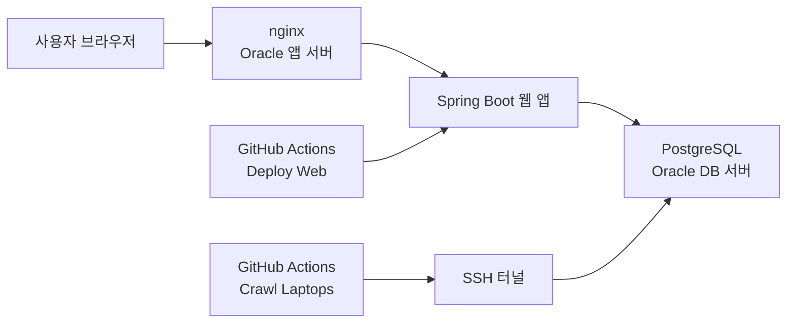

# LaptopGG

LaptopGG는 사용 목적, 예산, 무게, 화면 크기를 기준으로 노트북을 추천하고, 다나와 크롤링 데이터를 정규화해 상세 스펙과 추천 이유를 함께 보여주는 서비스입니다.

## 운영 구조



- 웹 서버는 Oracle 인스턴스에서 `systemd + java -jar`로 실행합니다.
- 리버스 프록시는 `nginx`가 담당합니다.
- 데이터베이스는 PostgreSQL을 사용합니다.
- `main` 브랜치에 push 하면 웹 앱이 자동 배포됩니다.
- 크롤러는 GitHub Actions에서 수동 실행하거나 스케줄 실행합니다.
- 목록 크롤링은 Danawa HTTP/AJAX 요청 기반이라 Chrome/Selenium 설치가 필요 없습니다.
- 운영 PostgreSQL 스키마는 Flyway 마이그레이션으로 관리합니다.
- 크롤러는 기존 상품의 가격/이미지/링크를 빠르게 갱신하고, 상세 스펙이 비었거나 오래된 상품만 다시 자세히 수집합니다.
- 가격 변동 이력은 `laptop_price_history` 테이블에 저장합니다.
- 크롤러 실행 이력은 `crawler_run` 테이블에 저장하고 PostgreSQL advisory lock으로 중복 실행을 차단합니다.

자세한 운영 구조는 `docs/architecture.md`, 서버 절차는 `ops/RUNBOOK.md`를 기준으로 봅니다.

## 저장소 구조

- `domain`: JPA entity, enum 등 도메인 모델
- `application`: 추천/상세/댓글 use case와 port
- `application-crawler`: crawler 저장/동기화 use case, crawler 전용 port, profile/score 정책
- `infrastructure-jpa`: Spring Data repository, Flyway migration, JPA adapter
- `infrastructure-jpa-crawler`: crawler 저장/프로필/가격 이력/추천 점수 JPA adapter와 crawler repository
- `infrastructure-jpa.adapter.shared/web/crawler`: 런타임 역할별 JPA adapter
- `infrastructure-jpa.repository.shared/web/crawler`: 런타임 역할별 Spring Data repository
- `infrastructure-jpa/src/main/resources/laptopgg-persistence.yml`: web/crawler 공통 PostgreSQL/Flyway/JPA profile 설정
- `infrastructure-security`: 비밀번호 해시 등 보안 adapter
- `web-app`: `web.controller`, `web.dto`, 사용자 화면, REST API, Thymeleaf/static 리소스
- `crawler-job`: GitHub Actions에서 실행하는 Danawa 수집 job
- `.github/workflows/ci.yml`: 테스트
- `.github/workflows/deploy-web.yml`: 웹 배포
- `.github/workflows/crawler.yml`: 크롤러 실행
- `ops/`: systemd, nginx, env 예시와 운영 runbook
- `nginx/oracle-laptopgg.conf`: 기존 Oracle 서버용 nginx 설정

저장소 루트가 곧 Gradle 프로젝트 루트입니다. 별도 하위 프로젝트로 들어갈 필요가 없습니다.

## 로컬 실행

### 1. PostgreSQL 실행

```bash
docker compose -f docker-compose.postgres.yml up -d
```

### 2. 웹 앱 실행

```bash
export JAVA_HOME=$(/usr/libexec/java_home -v 17)
export PATH="$JAVA_HOME/bin:$PATH"
export SPRING_DATASOURCE_URL=jdbc:postgresql://localhost:5432/laptopgg
export SPRING_DATASOURCE_USERNAME=laptopgg
export SPRING_DATASOURCE_PASSWORD=laptopgg
./gradlew :web-app:bootRun --args='--spring.profiles.active=postgres'
```

웹 앱은 사용자 화면과 추천/상세/댓글 API만 실행합니다. 크롤링은 아래 `crawler-job` 명령으로 별도 실행합니다.
`web-app`은 web use case bean을 명시적으로 조립하며, `application-crawler`와 crawler JPA adapter는 classpath에 올리지 않습니다.
`crawler-job`은 Danawa 수집과 application-crawler command 변환만 담당하며, domain entity 조립과 저장 트랜잭션은 application-crawler use case가 처리합니다.
크롤러 저장/이력/추천 점수 port는 `application-crawler`에 있고, 구현은 `infrastructure-jpa-crawler`가 제공합니다.

주의:
- `postgres` 프로필에서는 Flyway가 먼저 스키마를 맞춘 뒤 앱이 기동합니다.
- 기존 운영 DB처럼 이미 테이블이 있는 환경은 1회성으로 `legacy-baseline` 프로필 또는 `SPRING_FLYWAY_BASELINE_ON_MIGRATE=true`를 켜서 편입합니다.
- 일반 배포 프로필에서는 `baseline-on-migrate=false`를 유지합니다.

### 3. 크롤러만 단독 실행

```bash
export JAVA_HOME=$(/usr/libexec/java_home -v 17)
export PATH="$JAVA_HOME/bin:$PATH"
export SPRING_DATASOURCE_URL=jdbc:postgresql://localhost:5432/laptopgg
export SPRING_DATASOURCE_USERNAME=laptopgg
export SPRING_DATASOURCE_PASSWORD=laptopgg
./gradlew :crawler-job:bootRun --args='--spring.profiles.active=postgres,crawler --app.crawler.run-on-startup=true --app.crawler.limit=3 --app.crawler.start-page=1 --app.crawler.filter-profile=core'
```

### 4. 확인 주소

- 웹: `http://localhost:8080`
- 추천 화면: `http://localhost:8080/recommends`
- 상세 화면: `http://localhost:8080/laptops/{id}`

주의:
- 웹 앱은 크롤러 HTTP API를 열지 않습니다.
- 배포 프로필에서는 GitHub Actions 크롤러 job만 사용합니다.

## 테스트

```bash
export JAVA_HOME=$(/usr/libexec/java_home -v 17)
export PATH="$JAVA_HOME/bin:$PATH"
./gradlew --no-daemon test
./gradlew --no-daemon verifyStructure test :web-app:bootJar :crawler-job:bootJar
```

`verifyStructure`는 모듈 경계 회귀를 막는 Gradle 검증 태스크이며, `test` 실행 시에도 함께 실행됩니다.

회귀 테스트에는 실제 Danawa 구조를 닮은 HTML fixture가 포함됩니다.
- `crawler-job/src/test/resources/fixtures/danawa/list-page.html`
- `crawler-job/src/test/resources/fixtures/danawa/detail-page.html`
- `crawler-job/src/test/resources/fixtures/danawa/detail-spec.html`

CI에서는 `POSTGRES_INTEGRATION_TESTS=true`로 PostgreSQL/Flyway 마이그레이션 검증도 함께 실행합니다.

## 웹 배포

`main` 브랜치에 push 하면 `.github/workflows/deploy-web.yml` 이 실행됩니다.

배포 순서:
1. GitHub Actions가 JDK 17로 `test`와 `bootJar`를 실행합니다.
2. 생성된 jar를 `/home/ubuntu/laptopgg/releases/<sha>/`에 업로드합니다.
3. 앱 서버에서 `/home/ubuntu/laptopgg/app.jar` symlink를 새 release로 전환합니다.
4. `laptopgg.service`를 재시작하고 `/actuator/health/readiness`를 확인합니다.
5. 헬스 체크가 실패하면 이전 symlink 대상으로 rollback합니다.

배포 시점 동작:
- 신규 PostgreSQL: Flyway가 `V1`부터 최신 마이그레이션까지 적용합니다.
- 기존 PostgreSQL: 레거시 편입이 필요한 경우에만 `legacy-baseline`을 1회 사용합니다.

앱 서버에서 사용하는 주요 환경 변수 예시:

```bash
SPRING_PROFILES_ACTIVE=postgres,deploy
SPRING_DATASOURCE_URL=jdbc:postgresql://<db-private-ip>:5432/laptopgg
SPRING_DATASOURCE_USERNAME=<db-user>
SPRING_DATASOURCE_PASSWORD=<db-password>
JAVA_OPTS=-Xms128m -Xmx384m -Duser.timezone=Asia/Seoul
```

`systemd`와 nginx 기준 설정은 `ops/` 아래 예시를 사용합니다.

## 크롤러 운영

크롤러는 `.github/workflows/crawler.yml` 에서 실행합니다.

- 수동 실행 `workflow_dispatch`
- 재개 실행이 필요하면 `start_page` 입력으로 특정 페이지부터 다시 시작할 수 있습니다.
- `filter_profile` 입력으로 수집 범위를 고를 수 있습니다.
- 스케줄 실행 `cron: 17 19 * * *` (한국시간 기준 매일 04:17)

입력 규칙:
- `테스트용 처리 개수 제한` 칸에는 `100`처럼 숫자만 입력합니다.
- 빈칸으로 두면 전체 크롤링을 실행합니다.
- `수집 범위`는 `core`, `extended`, `none` 중 하나를 사용합니다.
- 기본값 `core`는 최신 Intel/AMD/ARM CPU 코드명과 Apple 맥북 카테고리만 수집합니다.
- `extended`는 조금 더 오래된 CPU 코드명까지 넓힙니다.
- `none`은 CPU 코드명 필터 없이 노트북 전체 목록을 수집합니다.

필요한 GitHub Secrets:

- `CRAWLER_SSH_HOST`
- `CRAWLER_SSH_PORT`
- `CRAWLER_SSH_USER`
- `CRAWLER_SSH_PRIVATE_KEY`
- `CRAWLER_DB_NAME`
- `CRAWLER_DB_USERNAME`
- `CRAWLER_DB_PASSWORD`
- `CRAWLER_TUNNEL_TARGET_HOST`
- `CRAWLER_TUNNEL_TARGET_PORT`

동작 방식:
1. GitHub Actions가 DB 서버로 SSH 접속합니다.
2. SSH 터널로 PostgreSQL에 연결합니다.
3. 목록은 HTTP/AJAX로, 상세는 HTTP 요청으로 수집합니다.
4. 기본값 `core`에서는 다나와 `CPU 코드명` 필터를 목록 단계에서 적용하고, Apple 맥북은 별도 카테고리로 수집합니다.
5. 기존 상품은 가격/이미지/링크만 빠르게 갱신하고, 상세 스펙이 비었거나 30일 이상 지난 상품만 상세 재수집합니다.
6. 가격이 실제로 변하면 `laptop_price_history`에 이력을 남깁니다.
7. `postgres,crawler` 프로필로 크롤러를 실행합니다.
8. advisory lock을 획득한 실행만 크롤링 결과를 DB에 직접 적재합니다.
9. 실행 상태와 처리 건수는 `crawler_run`에 남기고 GitHub Actions summary에도 표시합니다.

## nginx와 도메인

Oracle 서버에서는 `ops/nginx/laptopgg.conf` 를 기반으로 리버스 프록시를 설정합니다.

기본 흐름:
1. 도메인 `A` 레코드를 앱 서버 공인 IP로 연결
2. nginx `server_name`에 도메인 반영
3. `certbot --nginx` 로 HTTPS 발급

예시:

```bash
sudo cp ops/nginx/laptopgg.conf /etc/nginx/sites-available/laptopgg
sudo rm -f /etc/nginx/sites-enabled/default
sudo ln -sf /etc/nginx/sites-available/laptopgg /etc/nginx/sites-enabled/laptopgg
sudo nginx -t
sudo systemctl reload nginx

sudo apt-get update
sudo apt-get install -y certbot python3-certbot-nginx
sudo certbot --nginx -d laptopgg.com -d www.laptopgg.com
sudo certbot renew --dry-run
```

Cloudflare를 쓴다면:
- 초기 연결과 인증서 발급 때는 `DNS only`가 가장 단순합니다.
- 이후 다시 프록시를 켤 경우 SSL/TLS 모드는 `Full (strict)`를 권장합니다.

## 운영 체크 포인트

- 앱 상태: `sudo systemctl status laptopgg`
- 앱 로그: `journalctl -u laptopgg -f`
- nginx 상태: `sudo systemctl status nginx`
- nginx 로그: `sudo tail -f /var/log/nginx/access.log /var/log/nginx/error.log`
- DB 백업 예시:

```bash
pg_dump -h <db-private-ip> -U <db-user> -d laptopgg > laptopgg-$(date +%F).sql
```
